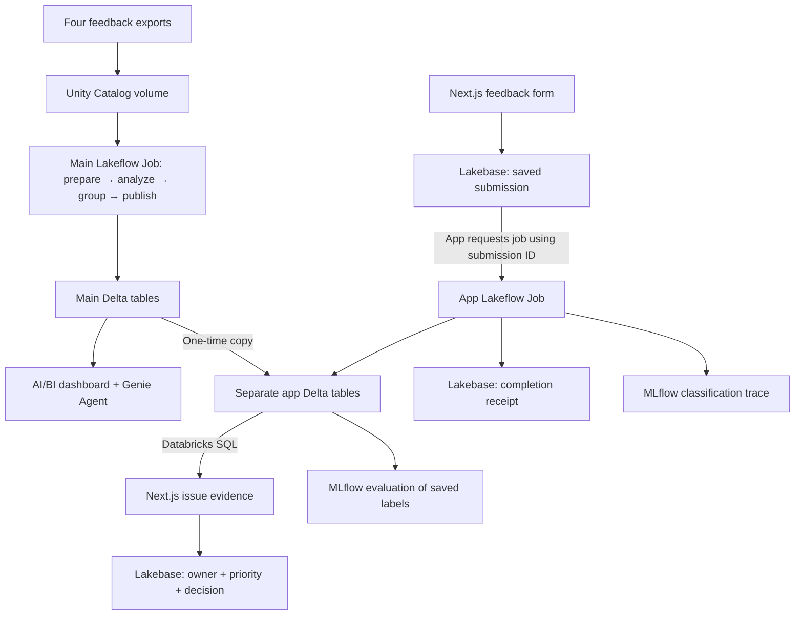

# Databricks Tutorial Demo · PapaEats

Follow the demo step by step: turn messy customer feedback into saved analysis, explore the problems with a dashboard and Genie, submit a new message from an app, inspect its AI output, and save a team decision.

**[Sign up for Databricks Free Edition](https://login.databricks.com/signup?provider=DB_FREE_TIER&utm_medium=influencer&utm_campaign=plug-pilot&utm_source=youtube&utm_content=short&utm_term=sonnysangha)**

PapaEats is a fictional food-delivery app. The supplied exports are synthetic. This project accompanies a Databricks-sponsored tutorial.

**Want your coding agent to do the setup?** Follow [the Databricks Agent Skills instructions](#set-this-up-with-your-favourite-coding-agent), then use the demo steps to explore your results.

## Before you begin

1. Get the project:

   ```bash
   git clone https://github.com/sonnysangha/databricks-tutorial-demo.git
   cd databricks-tutorial-demo
   ```

2. For a new workspace, follow [setup sections 1–4](docs/SETUP.md#1-prerequisites) to install the tools, sign in, configure the starter, create the volume, and upload the four exports. These are prerequisites, not a replacement for the demo steps below.
3. Open your feedback notebook with serverless compute and Genie Code. Have Catalog Explorer available in another tab. Create the dashboard, Genie Agent, and job as you reach their steps.
4. Before the app portion, complete the [app connection instructions](docs/SETUP.md#8-connect-the-application). These create its separate tables and job and start Next.js at `http://127.0.0.1:3017`.

Use your own workspace paths and resource IDs. The prompts below are the prompts used in the demo. Select the relevant files/tables in Genie Code or give it their full paths before sending them. Read its proposed code before running it.

**Using the supplied implementation:** the [setup reference](docs/SETUP.md) provides the exact notebook and job route if you want to run the included code. If those steps have already created an asset, open it and inspect its results at the matching demo step rather than recreating it. If you build with the prompts, use the supplied notebook's table names and column definitions so the later app can read your results.

## Set this up with your favourite coding agent

You can ask your coding agent to set up this project for you, then follow the demo below to understand each feature. The official **Databricks Agent Skills** give the agent Databricks-specific instructions for working with jobs, SQL, Unity Catalog, dashboards, Lakebase, and MLflow. Install them in the coding tool where you open this repository. [Official overview](https://docs.databricks.com/aws/en/agent-skills/)

### 1. Install the Databricks skills

Install or update the [Databricks CLI](https://docs.databricks.com/aws/en/dev-tools/cli/install), then run these commands from the cloned repository:

```bash
databricks --version
databricks aitools install --scope project
```

Choose your coding agent in the interactive installer. To target one directly, use its identifier:

| Coding agent | `--agents` value |
|---|---|
| Claude Code | `claude-code` |
| Codex CLI | `codex` |
| Cursor | `cursor` |
| GitHub Copilot | `copilot` |
| OpenCode | `opencode` |
| Gemini CLI | `gemini` |
| Antigravity | `antigravity` |
| Pi | `pi` |

For example, choose **one** command matching your tool:

```bash
databricks aitools install --agents codex --scope project
databricks aitools install --agents claude-code --scope project
databricks aitools install --agents cursor --scope project
```

Use `--scope global` instead if you want the installation available across projects. The current installer uses plugins for supported agents and raw skill files for others. Add `--skills-only` to explicitly install skill files without a plugin:

```bash
databricks aitools install --agents codex --scope project --skills-only
```

These options were checked against Databricks CLI **v1.16.0**. If your CLI does not recognize them, update it and check `databricks aitools install --help`. [Current CLI installation options](https://docs.databricks.com/aws/en/dev-tools/cli/reference/aitools-commands)

For a marketplace alternative, Claude Code supports `/plugin marketplace add databricks/databricks-agent-skills` followed by `/plugin install databricks@databricks-agent-skills`; Cursor supports `/add-plugin databricks`. Choose one installation method. For the Codex plugin, review and enable its hooks with `/hooks` after installing or updating. The skills-only route does not include those hooks. [Official plugin instructions](https://github.com/databricks/databricks-agent-skills#installation)

### 2. Verify installation and connect your workspace

```bash
databricks aitools list --scope project
```

Start a new session in your coding agent with this repository open, and ask it to confirm that it can load `databricks-core` and the relevant product skills. Listing installed files is useful, but the agent should also confirm it can discover them in its current session.

Choose a profile for your workspace and complete the OAuth browser login:

```bash
databricks auth login --host https://YOUR-WORKSPACE.cloud.databricks.com --profile papaeats-demo
databricks current-user me --profile papaeats-demo
```

Replace the workspace URL and use the same chosen profile in the setup prompt and generated configuration. Installing skills does not sign you in or grant access. Your agent needs terminal access to the authenticated CLI to perform the setup. Managed MCP servers are an additional connection option; skills installation does not configure them automatically. This tutorial can use the CLI route. [Skills and workspace tools](https://docs.databricks.com/aws/en/agent-skills/#ai-tools-and-managed-mcp-servers)

### 3. Give your agent this setup prompt

Paste this into your coding agent with the repository open. Replace the profile name if you chose a different one:

```text
Set up this PapaEats Databricks tutorial in my workspace. Carry out the setup
and verify the results, rather than only giving me a plan or commands to run.

Read README.md, docs/SETUP.md, and follow-along/README.md first. Load the
Databricks core skill, then the relevant skills for Unity Catalog, SQL,
AI functions, Lakeflow Jobs, dashboards, Genie, Lakebase, and MLflow.

Use my explicitly selected CLI profile: papaeats-demo. Verify the workspace
and signed-in identity before making changes. If that profile is unavailable,
ask me to choose one; do not silently select another. Use browser OAuth when
login is needed and keep credentials out of code, logs, and Git.

Inspect existing resources and ask me which catalog, main schema, separate
app schema, SQL warehouse, and Lakebase project/database to use or create.
Reuse this repository's implementation and configuration renderer. Do not
replace the Next.js app with a different scaffold or overwrite unrelated data.

Extract dist/papaeats-starter.zip, populate its identifier-only config.json,
and render my-papaeats. Create the baseline tables and raw volume, upload the
four exports, import the configured notebooks, and create the main refresh
job. Run it, wait for completion, and inspect all four tasks and table checks.

Build the dashboard and Genie Agent over the main tables using the README's
instructions. Create the separate app tables and Lakebase operational tables,
configure the app job and its permissions, and put its ID in web/.env.local.
Install dependencies, run the local checks, and start the app on port 3017.

Verify one fictional submission through to its saved result. Inspect its
MLflow trace, save an owner/priority/decision, and reload to confirm persistence.
Run the saved-classification quality evaluation and inspect flagged examples.

Keep the frontend local and jobs unscheduled. At the end, give me the local
app URL, workspace links, resource IDs, checks that passed, and any remaining
blockers. Distinguish local build success from actual successful cloud runs.
If a step needs a UI action you cannot perform, tell me the exact action and
continue with the remaining work that is possible.
```

If you only downloaded the starter ZIP, tell the agent to read `TUTORIAL.md`, `docs/SETUP.md`, and the extracted `README.md` instead of the repository paths, and to skip the extraction step when it is already extracted.

The agent can perform the setup through its available tools once it has your chosen resources and permissions. Login, unavailable features, quotas, or restricted agent tools may still require your input. Use the step-by-step walkthrough below to inspect what it created; do not treat a generated configuration file as proof that the workflow ran.

To check for skill updates later:

```bash
databricks aitools update --check
databricks aitools update
```

## Follow the demo

1. [Bring the feedback together](#step-1-bring-the-feedback-together)
2. [Find the saved data in Unity Catalog](#step-2-find-the-saved-data-in-unity-catalog)
3. [Turn messages into useful labels](#step-3-turn-messages-into-useful-labels)
4. [Explore recurring problems in a dashboard](#step-4-explore-recurring-problems-in-a-dashboard)
5. [Create a Genie Agent and ask questions](#step-5-create-a-genie-agent-and-ask-questions)
6. [Make the processing repeatable](#step-6-make-the-processing-repeatable)
7. [Submit feedback from the Next.js app](#step-7-submit-feedback-from-the-nextjs-app)
8. [Inspect the AI output with MLflow](#step-8-inspect-the-ai-output-with-mlflow)
9. [Assign an owner and save a decision](#step-9-assign-an-owner-and-save-a-decision)
10. [Review the complete loop](#step-10-review-the-complete-loop)

## Step 1. Bring the feedback together

**What you are learning:** Genie Code helps turn scattered files into usable data; the notebook keeps the code and results together.

Open your feedback notebook and Genie Code. Select the four uploaded exports: `app_store_reviews.csv`, `google_play_reviews.csv`, `in_app_feedback.json`, and `support_tickets.csv`. They contain the same kind of customer feedback in different formats.

Ask Genie Code:

```text
Inspect these four feedback exports. Show a few examples and explain what needs cleaning before we combine them.
```

Read its findings and inspect a few raw records. Look for different date formats, column names, duplicate submissions, and contact details. Then ask:

```text
Combine and clean the feedback. Make the dates and columns consistent, remove duplicate submissions, and hide email addresses and phone numbers. Keep different messages from the same customer and leave the original files unchanged. Save the result and show what changed.
```

Run the reviewed cleaning code and save the result as `feedback_clean` in your main schema. Keep the supplied notebook's canonical columns: `source`, `feedback_id`, `user_id`, `message_text`, `rating`, `timestamp`, `app_version`, and `metadata`.

**Check before continuing:** compare one raw message with its cleaned version. Confirm dates and columns are consistent, contact patterns are masked, separate messages from one customer remain, and the original exports have not changed. Compare raw and cleaned row counts. The video example went from 2,227 records to 2,078 messages; use your actual results rather than forcing that total.

[File upload and inspection details](docs/SETUP.md#4-upload-and-inspect-the-feedback) · [Supplied cleaning implementation](docs/SETUP.md#5-clean-classify-and-publish)

## Step 2. Find the saved data in Unity Catalog

**What you are learning:** a volume holds files; a table holds queryable records. Unity Catalog organizes these objects and their access permissions.

1. Open **Catalog → your catalog → your main schema → feedback_clean**. With the default names, this is `workspace → papaeats → feedback_clean`.
2. Open the table's sample data and inspect its columns and cleaned messages.
3. Find the `raw` volume in the same schema and identify the four source files.
4. Open the table's **Permissions** tab and inspect its owner and existing access grants.

**Check before continuing:** you can find both the original files and the cleaned table, and understand which object the notebook saved. The notebook, dashboard, and Genie Agent will use the same main tables. Inspecting permissions does not require changing them; assigning an issue owner later is a separate application action.

## Step 3. Turn messages into useful labels

**What you are learning:** SQL AI functions use an existing foundation model to label feedback without training your own model.

Return to the notebook, select the cleaned table as context, and ask Genie Code:

```text
Use Databricks AI to categorize a small sample of our cleaned feedback and identify its sentiment. Show each message beside its labels and a short explanation, and flag anything uncertain.
```

Review the small sample before processing the full dataset. Find a checkout complaint and a feature request. Read the customer's words beside the category, sentiment, and explanation; check whether uncertain cases are flagged.

When the sample is reasonable, ask:

```text
Apply this approach to the remaining feedback and save the results. Keep the original messages and flag anything that needs review.
```

Run the reviewed code and save the analysis as `feedback_analyzed`. For compatibility with the app, retain the cleaned fields and add `category`, `confidence_score`, `explanation`, `sentiment`, and `uncertain_classification`, as in the supplied notebook.

**Check before continuing:** each saved label remains attached to its original message. A checkout malfunction may be `BUG_REPORT` with negative sentiment; a request for a new capability should remain a feature request. Inspect unexpected outputs instead of assuming the label is correct. A model confidence score is not measured accuracy.

[Small SQL sample, full workflow, and table checks](docs/SETUP.md#5-clean-classify-and-publish)

## Step 4. Explore recurring problems in a dashboard

**What you are learning:** saved analysis becomes useful when you can see recurring issues and inspect their supporting messages.

In Genie Code, with the saved analysis selected, ask:

```text
Group our saved feedback into recurring problems and feature requests. Build a dashboard showing the biggest groups, sentiment and feedback that needs review. Let us select an issue and source to see the customer messages behind the numbers. Show message counts separately from user counts.
```

Review the grouping logic. This project's detailed issue labels use keyword rules; AI supplies the broad category and sentiment. Save row-level membership as `feedback_with_issue_type` and aggregates as `issue_summary`, matching the supplied notebook.

Open your issue summary, then **PapaEats Feedback Overview**. If you need to build it manually, follow the [dataset, widget, filter, and publication steps](docs/SETUP.md#6-build-the-dashboard).

1. Find the largest complaint group and inspect its message count.
2. Use the **Issue type** dropdown to choose **Payment/Checkout Failure**.
3. Read a customer message and its explanation in the evidence table.
4. Compare the message total, source-qualified user IDs, and needs-review total.
5. Add **Feedback source → in_app** and confirm the evidence and counters narrow together.

**Check before continuing:** every displayed total is backed by the filtered messages. The video's checkout selection showed 45 messages, 44 source/user IDs, and 9 needing review; these are example results, not required values for your run. Message counts are not counts of verified people. Use dropdown filters for this walkthrough.

## Step 5. Create a Genie Agent and ask questions

**What you are learning:** Genie Code helps build the workflow; a Genie Agent helps the team ask questions about its saved data.

Open Genie Code beside the saved main analysis and issue summary. Ask:

```text
Create a Genie Agent called “PapaEats Customer Feedback” using our saved analysis and issue summary. Help it distinguish complaints from feature requests, count messages separately from customers, and show evidence for its answers.
```

Review the proposed setup and create the agent if it does not already exist. Open **PapaEats Customer Feedback → configuration** and check its connected tables and instructions. It should use your main `feedback_with_issue_type` and `issue_summary` tables, distinguish complaints from feature requests, count messages separately from source/user IDs, and provide evidence. The [manual setup](docs/SETUP.md#7-create-a-genie-agent) includes copyable agent instructions.

Switch to the **Genie Agent's Chat** screen and ask:

```text
What are the biggest customer complaints and bugs? Show the message counts in a chart and keep feature requests separate.
```

Then follow up in the same chat:

```text
Show five customer messages behind the biggest problem.
```

**Check before continuing:** inspect the answer, chart, generated SQL, and supporting messages. Compare the totals with your saved tables. The video example returned Late Delivery at 119 messages; your answer should reflect your own data. Keep feature requests separate from complaints and bugs.

## Step 6. Make the processing repeatable

**What you are learning:** Lakeflow Jobs runs saved notebook code in order; it does not replay the Genie Code conversation.

Return to Genie Code with your working notebook and ask:

```text
Turn our working notebook into a repeatable feedback workflow. Process new and updated feedback, reuse unchanged analysis, and keep each issue linked to its customer messages. Show the steps and what was processed or skipped.
```

Review the resulting workflow, or create the supplied **PapaEats Feedback Refresh** job using [the generated main-job instructions](docs/SETUP.md#5-clean-classify-and-publish). Keep one main refresh job rather than creating both versions.

Open **Jobs & Pipelines → PapaEats Feedback Refresh → Tasks**. Confirm the sequence:

1. **Prepare feedback:** normalize and mask the inputs.
2. **Analyze changes:** reuse unchanged analysis and classify new or updated text.
3. **Group and check:** attach issue membership and validate counts.
4. **Publish results:** save the validated analysis for other tools.

Run the job and wait for all four tasks to succeed. Open its completed run and inspect the processed/skipped counts. If it has already run successfully, inspect that run. An unchanged-input rerun should reuse saved classifications.

**Check before continuing:** each task waits for the previous one to succeed, the output identifies what was processed or skipped, and the published tables retain message evidence. This is the main export-refresh job; the next step uses a separate app-submission job.

## Step 7. Submit feedback from the Next.js app

**What you are learning:** Lakebase persists a new customer message, then the app requests Lakeflow Jobs to process it.

Complete [the app connection setup](docs/SETUP.md#8-connect-the-application) first: copy the main analysis into the separate app schema, create the two Postgres tables, import the configured app notebook, create the app job, and start Next.js.

Open **[Submit feedback](http://127.0.0.1:3017/submit)** and submit this fictional complaint once:

> Every time I tap Pay, checkout shows an error and my order never goes through. I tried two cards and restarting the app. Please fix checkout.

1. Follow the submission's progress page.
2. Open **View workflow** to inspect the requested app job.
3. Wait for processing to finish; this can take several minutes.
4. Return to the saved result and inspect the issue, sentiment, and explanation.

**Check before continuing:** the message is saved and its completed result is available from the submission link. The app requests the job after the save; inserting a database row by itself is not an automatic trigger. This app uses separate analytical tables from the earlier dashboard and Genie Agent. The frontend is running locally.

## Step 8. Inspect the AI output with MLflow

**What you are learning:** MLflow lets you inspect AI inputs and outputs and review quality assessments.

From the completed app result, choose **Open MLflow traces → Traces → Classify new feedback (Spark)**. Read the prepared customer message alongside the saved category, sentiment, and explanation. Match them with the app's result.

**Check the trace:** it captures the Spark classification/materialization step and saved-response readback. Its duration is not provider-only latency, and it does not supply token usage or cost. Use the job timeline for total processing time. If the trace link is missing, check experiment permissions and trace warnings in the job output.

For the optional quality review, ask Genie Code:

```text
Use MLflow to review a small sample of our saved classifications. Check whether the category and sentiment fit each message and whether the explanation adds unsupported details. Show examples that need attention and explain why.
```

Use [the MLflow evaluation commands](docs/SETUP.md#10-inspect-mlflow-traces-and-quality) to evaluate a varied sample of saved outputs. Open **Experiments → Classification Quality → your evaluation run**, inspect the category, sentiment, and explanation assessment columns, and open a flagged example to read the judge's reason.

For example, the video's message “Check out my restaurant review channel!!! link in bio” was categorized as Unclear but had positive sentiment. Its sentiment assessment flagged that it was promotional text rather than praise for the app. If your sample contains that message, compare your saved result; otherwise inspect one of your own flagged examples.

**Check before continuing:** you can see the original message, the saved answer, and the reason it was flagged. The judge evaluates existing classifications; it does not correct them or rerun the classifier. Its score is a review aid, not a guarantee of correctness or a population accuracy estimate.

## Step 9. Assign an owner and save a decision

**What you are learning:** AI organizes evidence; the team decides what to do. Lakebase keeps that decision after the page reloads.

From the completed submission, open **Review issue & assign owner**:

1. Enter **Checkout team** as the owner.
2. Select priority **P1** and **Approve for action**.
3. Click **Save owner & decision**.
4. Find **Stored in Lakebase Postgres** and inspect the owner, priority, decision, and saved time.
5. Click **Reload from database**.
6. Open **[Saved decisions](http://127.0.0.1:3017/decisions)** and verify the same issue and decision appear.
7. In **Where this is saved**, identify `papaeats_app.issue_decisions`.

**Check before continuing:** the values survive the reload because the app reads the persisted Postgres record. Analytical results and team decisions are stored separately, so a feedback refresh does not replace the owner or decision. Assigning an owner means responsibility for an issue; it does not grant database access.

## Step 10. Review the complete loop

Return to the app overview or your saved decision. You have followed the same sequence as the demo:

**Scattered exports → cleaned data → AI labels → dashboard and Genie answers → repeatable job → new app submission → MLflow inspection → saved team decision.**

Try another fictional message and inspect its actual output. Use the evidence to decide what to fix rather than treating the AI label as a decision. Databricks Apps is an optional hosting extension; this walkthrough runs the frontend locally. See [hosting considerations](docs/SETUP.md#optional-hosting) before exposing an app.

**[Try Databricks Free Edition with your own idea](https://login.databricks.com/signup?provider=DB_FREE_TIER&utm_medium=influencer&utm_campaign=plug-pilot&utm_source=youtube&utm_content=short&utm_term=sonnysangha)**

## How the pieces connect



The main dataset powers the dashboard and Genie Agent. The app starts with its own copy and adds submissions independently. Refreshing analysis does not overwrite team decisions.


*The local app’s workflow guide. Cloud processing and saved results require the linked setup reference.*


## Setup, troubleshooting, and source

- **[Detailed setup reference](docs/SETUP.md):** prerequisites, identifiers, imports, SQL, commands, and permissions.
- **[Troubleshooting](docs/SETUP.md#12-troubleshooting):** missing tables, paths, permissions, quotas, and failed runs.
- **[Copyable prompts](prompts/genie-code.md):** the prompts from the steps above.
- **[Starter ZIP](dist/papaeats-starter.zip):** configurable notebooks, application, and evaluation code.
- **[Repository map and checks](docs/SETUP.md#repository-map-and-local-checks):** source locations and local validation commands.

Local tests and builds do not establish that a new Databricks workspace has completed the workflow. Run the steps and check their results in your own workspace.
