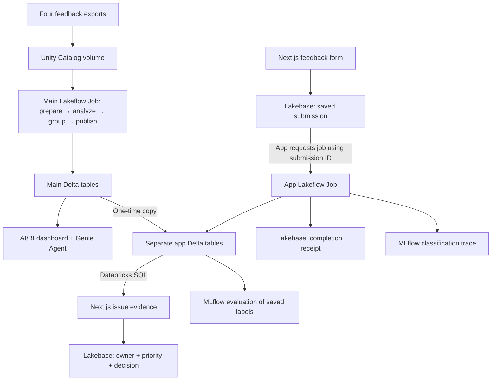
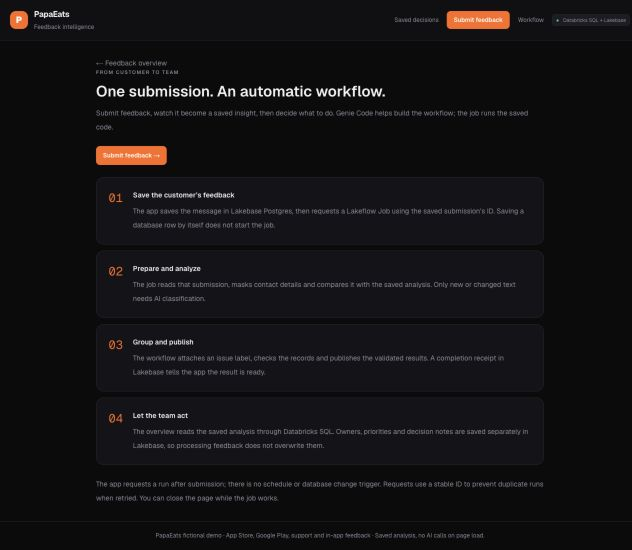

# Databricks Tutorial Demo · PapaEats

Turn scattered customer feedback into an issue list your team can act on. This tutorial combines Databricks notebooks, Genie Code, Unity Catalog, SQL AI functions, AI/BI dashboards, Genie Agents, Lakeflow Jobs, MLflow, and Lakebase Postgres with a Next.js application.

**[Sign up for Databricks Free Edition](https://login.databricks.com/signup?provider=DB_FREE_TIER&utm_medium=influencer&utm_campaign=plug-pilot&utm_source=youtube&utm_content=short&utm_term=sonnysangha)**

PapaEats is a fictional food-delivery company. All supplied customer exports are synthetic. This project accompanies a Databricks-sponsored tutorial.

## What you will build

- Combine four differently formatted exports and mask contact details.
- Label messages with an AI category, sentiment, confidence score, and explanation.
- Group recurring issues and inspect the messages behind the totals.
- Explore the results in a dashboard and ask a Genie Agent questions.
- Run a repeatable workflow that reuses unchanged classifications.
- Submit feedback through a local Next.js app and follow its job progress.
- Inspect an MLflow trace and evaluate saved classifications with AI judges.
- Save an issue owner, priority, and decision in Lakebase and read it back.



The main dataset powers the dashboard and Genie Agent. The app starts with its own copy and adds submissions independently. Refreshing analysis does not overwrite team decisions.



*The local app’s workflow guide. Cloud processing and saved results require the setup below.*

## Contents

1. [Prerequisites](#1-prerequisites)
2. [Get the files and sign in](#2-get-the-files-and-sign-in)
3. [Create your Lakebase database and configure the starter](#3-create-your-lakebase-database-and-configure-the-starter)
4. [Upload and inspect the feedback](#4-upload-and-inspect-the-feedback)
5. [Clean, classify, and publish](#5-clean-classify-and-publish)
6. [Build the dashboard](#6-build-the-dashboard)
7. [Create a Genie Agent](#7-create-a-genie-agent)
8. [Connect the application](#8-connect-the-application)
9. [Submit feedback and save a decision](#9-submit-feedback-and-save-a-decision)
10. [Inspect MLflow traces and quality](#10-inspect-mlflow-traces-and-quality)
11. [Verify repeatability and access](#11-verify-repeatability-and-access)
12. [Troubleshooting](#12-troubleshooting)

## 1. Prerequisites

You need:

- A Databricks workspace with a SQL warehouse, serverless notebooks/Jobs, Unity Catalog, SQL AI functions, and Lakebase Postgres.
- Permission to create a schema, volume, tables, notebooks, jobs, dashboards, Genie Agents, and MLflow experiments. Your job's run-as identity needs access to the same data.
- **Node.js 24+**, npm, **Python 3.10+**, Git, and the [Databricks CLI](https://docs.databricks.com/aws/en/dev-tools/cli/install). The optional local MLflow evaluation uses [uv](https://docs.astral.sh/uv/getting-started/installation/).
- A browser and a terminal. No separately supplied model API key is used by this project; AI execution uses your workspace access and quotas.

Start with Free Edition. Its features and quotas can vary, so check the [current Free Edition limits](https://docs.databricks.com/aws/en/getting-started/free-edition-limitations) if compute or a feature is unavailable. The first analysis processes the full dataset and uses more compute than a small sample.

The tutorial runs the Next.js frontend **locally**. Hosting on Databricks Apps is a separate extension; this repository does not claim a hosted deployment or a fresh-workspace end-to-end validation.

## 2. Get the files and sign in

```bash
git clone https://github.com/sonnysangha/databricks-tutorial-demo.git
cd databricks-tutorial-demo
unzip dist/papaeats-starter.zip
cd papaeats-starter
cp config.example.json config.json
```

The ZIP contains a configuration tool and the app, notebook, SQL, and evaluation templates. Run the configuration tool from this extracted directory, where its `template/` directory exists. Repository contributors can rebuild the ZIP with `python3 scripts/package_follow_along.py` from the repository root.

Choose a profile name for **your** workspace. The examples use `papaeats-demo`; use that consistently or replace it in both commands and configuration.

```bash
databricks auth login --host https://YOUR-WORKSPACE.cloud.databricks.com --profile papaeats-demo
databricks current-user me --profile papaeats-demo
```

Complete the browser login and confirm that the returned user belongs to your intended workspace. Copy the workspace origin from your browser without a page path. Open **SQL Warehouses**, select your warehouse, and copy its warehouse ID from its details/connection information.

## 3. Create your Lakebase database and configure the starter

1. Open **Lakebase** in Databricks and create a dedicated Postgres project, for example `papaeats-tutorial`. If you already have a project, use a database you own and intend to use for this tutorial.
2. Wait for its compute endpoint to be ready. In **Connect**, choose your database and your OAuth database role.
3. Copy the **host**, **database name**, and **role/user**. Copy the endpoint resource name separately: it looks like `projects/PROJECT/branches/BRANCH/endpoints/ENDPOINT`. It is not the hostname or a connection URL.
4. Use your own user as both the local connection identity and job run-as identity for this walkthrough. That identity must have database access. See the [Lakebase getting-started guide](https://docs.databricks.com/aws/en/oltp/projects/get-started) for the connection screen.
5. Fill every field in the extracted `config.json`:

| Field | What to enter |
|---|---|
| `workspace_host` | Your HTTPS workspace origin |
| `profile` | The CLI profile you just signed into |
| `workspace_user` | Your Databricks username/email; used for workspace notebook and experiment paths |
| `warehouse_id` | Your SQL warehouse ID |
| `catalog` | An accessible catalog, usually `workspace` |
| `main_schema` | `papaeats` or a new schema you own |
| `app_schema` | A **different** schema, such as `papaeats_app_demo` |
| `raw_path` | `/Volumes/YOUR_CATALOG/YOUR_MAIN_SCHEMA/raw` |
| `lakebase_endpoint` | The full endpoint resource name from step 3 |
| `pg_host` | Lakebase hostname only, without `https://` |
| `pg_database` | The selected Postgres database name |
| `pg_user` | Your OAuth database role/user |

Use simple letters, numbers, and underscores for catalog/schema names. Keep all tokens and passwords out of this file. The local app uses your CLI OAuth login and refreshes short-lived Lakebase credentials.

Generate your configured project:

```bash
python3 configure.py --config config.json --output my-papaeats
cd my-papaeats
```

This writes local files only. It refuses incomplete placeholders and refuses to overwrite an existing output directory. From now on, terminal paths in steps 4–10 are relative to **this generated `my-papaeats` directory**, unless stated otherwise.

The generated app notebook contains your database identifiers and an explicit guard restricting it to your chosen app schema. Do not import the unconfigured template directly.

## 4. Upload and inspect the feedback

Open the Databricks SQL editor, choose your warehouse, paste **`sql/00_bootstrap.sql`**, and run it. This creates your main schema, a managed `raw` volume, and four empty baseline tables. Existing tables are not replaced. Use a fresh tutorial schema if similarly named tables already contain unrelated data.

In **Catalog → your catalog → your main schema → Volumes → raw**, upload these four files from the generated `data/` directory:

| File | Contents | Format difference |
|---|---|---|
| `app_store_reviews.csv` | App Store reviews | Title/body, rating, ISO dates |
| `google_play_reviews.csv` | Google Play reviews | Different column names and day-first dates |
| `support_tickets.csv` | Support conversations | Email identifiers and epoch-millisecond timestamps |
| `in_app_feedback.json` | In-app messages | JSON array and no independent message ID |

There are **2,227 raw records** across the supplied files. Leave the originals unchanged.

Create an exploratory Python notebook, connect serverless compute, and open Genie Code. Supply your volume path and ask:

```text
Inspect the four feedback exports in /Volumes/workspace/papaeats/raw.
Show a few examples and explain what needs cleaning before we combine them.
Leave the original files unchanged.
```

Replace the path if you chose other names. Check the source columns and dates. You can use the [copyable prompts](prompts/genie-code.md) throughout the tutorial. Genie Code helps you inspect and understand the data; the supplied refresh notebook below provides a consistent implementation.

Before running the full analysis, test SQL AI functions on a small sample in a SQL notebook cell or the SQL editor:

```sql
SELECT content,
       ai_classify(content, ARRAY('bug', 'feature request', 'complaint', 'praise', 'question', 'spam')) AS category,
       ai_analyze_sentiment(content) AS sentiment
FROM read_files('/Volumes/workspace/papaeats/raw/google_play_reviews.csv',
                format => 'csv', header => true)
LIMIT 5;
```

Read each label beside its message. The sample's short label list is an introduction; the refresh notebook uses nine more detailed categories, rationales, and confidence scores through [ai_classify version 2.1](https://docs.databricks.com/aws/en/sql/language-manual/functions/ai_classify).

## 5. Clean, classify, and publish

In **Workspace**, create a folder called `papaeats-demo` under your user folder. Import **`notebooks/PapaEats Feedback Refresh.py`** using **Import → File**. Its workspace path must match the path in generated **`main-job.json`**. The notebook's default `review` step only explains the workflow; it does not process data.

Create the job from your generated directory:

```bash
databricks jobs create --json @main-job.json --profile papaeats-demo
```

Copy the returned `job_id`. Open that job in **Jobs & Pipelines** and inspect the four tasks:

| Task | What it does |
|---|---|
| `prepare_feedback` | Reads exports, normalizes fields/dates, deduplicates by source and stable ID, masks contact patterns, and checks invalid records |
| `analyze_changes` | Reuses saved labels for unchanged text; classifies new/changed text and saves the AI response |
| `group_and_check` | Applies keyword issue-grouping rules and checks that summaries reconcile to message evidence |
| `publish_results` | Publishes the four validated analysis tables |

Each task depends on the previous task succeeding. The configuration uses serverless compute, one active run, queueing, no schedule, and disabled task/optimization retries. Keep the job run-as identity set to the user you configured. If prompted, select a supported serverless environment for all tasks.

Click **Run now**, or run this command after substituting your numeric job ID:

```bash
databricks jobs run-now YOUR_MAIN_JOB_ID --profile papaeats-demo
```

The initial run starts with empty baseline tables and classifies the dataset. Later runs reuse unchanged analysis. Inspect **Runs → task → Output** for processed, skipped, failed, and review counts. Wait until **all four tasks succeed** before continuing.

The notebook creates:

| Table | Purpose |
|---|---|
| `feedback_clean` | Normalized messages with masked contact patterns |
| `feedback_analyzed` | Messages with category, sentiment, confidence, explanation, and review flag |
| `feedback_with_issue_type` | Row-level evidence with rule-based issue membership |
| `issue_summary` | Aggregated issue counts and evidence |

Check your tables in Catalog Explorer and run these SQL checks, adjusting the namespace if needed:

```sql
SELECT COUNT(*) AS messages FROM workspace.papaeats.feedback_clean;
SELECT COUNT(*) AS analyzed FROM workspace.papaeats.feedback_analyzed;
SELECT COUNT(*) AS evidence_rows FROM workspace.papaeats.feedback_with_issue_type;
SELECT source, feedback_id, COUNT(*) AS copies
FROM workspace.papaeats.feedback_with_issue_type
GROUP BY source, feedback_id HAVING COUNT(*) > 1;
SELECT issue_category, issue_type, total_messages, unique_users, needs_review
FROM workspace.papaeats.issue_summary ORDER BY total_messages DESC;
```

The first three totals should agree and the duplicate-key query should return no rows. AI labels and rankings can vary; use your results rather than trying to match a fixed screenshot or video count.

**How to interpret the output:** AI assigns the broad category and sentiment. Detailed issues such as “Payment/Checkout Failure” use keyword rules, not semantic clustering. `unique_users` counts distinct **source + user ID** pairs, not verified people across platforms. Confidence is a model output, not measured accuracy. Pattern-based masking does not detect every possible form of personal information.

## 6. Build the dashboard

1. Open **Dashboards → Create dashboard** and name it **PapaEats Feedback Overview**.
2. Choose your SQL warehouse. In the **Data** tab, create one dataset using generated **`sql/dashboard.sql`**. It reads your main `feedback_with_issue_type` table.
3. Preview the dataset and confirm the message text, category, issue, sentiment, explanation, and review fields appear.
4. Add the following widgets to the canvas, all using this same row-level dataset:

| Widget | Configuration |
|---|---|
| Messages counter | Count rows / `feedback_id` |
| Source + user IDs counter | Count distinct `source_user_key` |
| Needs review counter | Sum `needs_review` |
| Recurring issues bar chart | Issue type vs. message count, descending; exclude null issue types |
| Sentiment chart | Sentiment vs. message count |
| Evidence table | Source, feedback ID, message, category, issue type, sentiment, explanation, review status |

5. Add dropdown field filters for `issue_type`, `source`, and `category`. Bind each filter to its corresponding field in the dataset. Keep category and issue type as separate filters.
6. Select **Payment/Checkout Failure**, then a source. Check that the evidence and counters narrow together. The message counter should equal the filtered evidence count; distinct users may be lower.
7. Publish the dashboard. Use viewer credentials if each viewer should query using their own data permissions. Test the published dropdown filters as well as the draft.

You can also ask Genie Code to help create the layout, using the dashboard prompt in the prompt guide. Review its dataset and counts before publishing.

## 7. Create a Genie Agent

Open **Genie** and create an agent (some interfaces call this a Genie Space). Name it **PapaEats Customer Feedback**, choose your warehouse, and connect the main `feedback_with_issue_type` and `issue_summary` tables.

Add these instructions:

```text
Use feedback_with_issue_type for row-level customer evidence and issue_summary
for precomputed issue totals. Do not join them in a way that multiplies counts.
Keep feature requests separate from complaints and bugs.
Count messages separately from distinct source + user ID pairs.
Do not describe user IDs as verified individual people.
Detailed issue types use keyword rules. Broad categories and sentiment use AI.
Show supporting messages and flag uncertain results. Never invent evidence.
```

Ask **inside the Genie Agent**:

```text
What are the biggest customer complaints and bugs? Show the message counts
in a chart and keep feature requests separate.
```

Then ask:

```text
Show five customer messages behind the biggest problem.
```

Inspect the generated SQL and compare its totals with your tables/dashboard. Genie Code helps build the workflow; the Genie Agent answers questions about the saved tables you connected. The agent does not automatically see the app's separate schema.

## 8. Connect the application

### Create the app's analytical tables

After the main job succeeds, run generated **`prepare-app-tables.sql`** in the Databricks SQL editor. It creates your separate app schema and deep-clones the four main tables.

Run this once. It intentionally fails if the app tables already exist; do not replace them after adding submissions. The main and app datasets grow independently after this copy.

### Create the operational Postgres tables

Open your **Lakebase SQL editor**, select the database from `pg_database`, and run these generated files in order:

1. `sql/06_app_decisions.sql`
2. `sql/07_app_submissions.sql`

These are **Postgres SQL**, not Databricks warehouse SQL. They create `papaeats_app.issue_decisions` and `papaeats_app.feedback_submissions`.

The local app user and job run-as database role need `USAGE` on `papaeats_app` and `SELECT`, `INSERT`, `UPDATE` on these tables. Using the same database owner for both is simplest for this private tutorial. For another existing OAuth role, the database owner can grant:

```sql
GRANT USAGE ON SCHEMA papaeats_app TO "YOUR_DATABASE_ROLE";
GRANT SELECT, INSERT, UPDATE ON papaeats_app.feedback_submissions,
  papaeats_app.issue_decisions TO "YOUR_DATABASE_ROLE";
```

### Create the app job

Import **`notebooks/PapaEats App Feedback.py`** into the same workspace `papaeats-demo` folder. Match its path to **`app-job.json`**. Its notebook installs the required Python packages and uses the same four processing stages, but reads a saved Lakebase submission instead of the original exports.

```bash
databricks jobs create --json @app-job.json --profile papaeats-demo
```

Copy the returned job ID into **`web/.env.local`** as `SUBMISSION_JOB_ID`. Check the job's serverless environment, run-as identity, and access to the app schema, Lakebase database, and MLflow experiment folder.

**Do not click Run now without a submission ID.** This job requires a UUID saved by the app; a missing input intentionally stops processing.

### Start Next.js

The configuration tool already wrote **`web/.env.local`** with your identifiers. Keep `LOCAL_DEMO_MODE=true`, `FEEDBACK_BACKEND=sql`, and `ENABLE_DECISIONS=true`. `APP_ORIGIN` must be `http://127.0.0.1:3017` for the command below.

```bash
cd web
npm ci
npm test
npm run build
npx next dev -p 3017 -H 127.0.0.1
```

Open **[http://127.0.0.1:3017](http://127.0.0.1:3017)**, using exactly that host and port. The overview reads your app Delta table through Databricks SQL; Lakebase stores submissions and decisions. The local app is private to this machine and does not implement public customer accounts.

## 9. Submit feedback and save a decision

1. Open **Submit feedback** and enter a fictional message, for example:

   > Every time I tap Pay, checkout shows an error and my order never goes through. I tried two cards and restarting the app. Please fix checkout.

2. Submit once. The server first commits the message to Lakebase, then requests the app job using its saved UUID.
3. Follow the progress page and **View workflow** link. Wait for the saved result; processing can take several minutes.
4. Read the returned category, sentiment, explanation, and issue. If the outcome seems wrong, retain it for review rather than assuming the model is correct.
5. Select **Review issue & assign owner**. Enter **Checkout team**, choose **P1** and **Approve for action**, and save.
6. Check **Stored in Lakebase Postgres**, then click **Reload from database** and open **Saved decisions**. The owner, priority, decision, and saved time should remain.

The app requests the job after saving; a Postgres insert alone is not a database trigger. Decision ownership assigns team responsibility and does not grant database permissions. Review/approval is a human action, never inferred from an AI label.

If a run fails, inspect its failed task. The input remains saved. Use **Retry processing** after fixing the cause and confirming the earlier run has terminated. Stable submission IDs and attempt tokens prevent duplicate dispatch for the same request. There is no background outbox worker in this tutorial.

## 10. Inspect MLflow traces and quality

### Inspect the classification trace

From a completed app result, select **Open MLflow traces**. Open the matching trace in your **App Classifications** experiment and select **Classify new feedback (Spark)**.

Compare the prepared message with the saved category, sentiment, explanation, and classifier version. The span covers Spark materialization and saved-response readback. It does not report provider-only latency, token usage, or model cost. Use the Lakeflow task timeline to inspect the complete job duration.

Tracing is observational. A trace export failure does not repeat the AI action; a result can finish without a trace link if tracing failed. Inspect task output and experiment permissions in that case.

### Evaluate saved classifications

Stop the local dev server if you want to reuse that terminal, or open a second terminal. From your generated **`my-papaeats` directory**, run:

```bash
uv run --with 'mlflow[databricks]==3.16.0' python mlflow/evaluate_saved_feedback.py --sample-only
uv run --with 'mlflow[databricks]==3.16.0' python mlflow/evaluate_saved_feedback.py --reuse-sample
```

The first command reads up to 20 saved classifications, selecting a varied spread across categories and review flags, and saves `mlflow/sample.json`. The second evaluates **that same sample**, makes AI-judge calls, and logs an MLflow run. It does not rerun the classifier or change app tables. Without either option, the script creates a new sample and evaluates it.

The configured script uses your selected CLI profile, SQL warehouse, app table, and experiment path. It uses `databricks-gpt-oss-120b` as its judge; if your workspace lacks this endpoint, choose an available supported judge model in `scorers()` before running.

Open **Experiments → your papaeats-demo folder → Classification Quality**, then open the new run and inspect:

| Assessment | Question |
|---|---|
| `category_supported` | Does the selected category fit the message? |
| `sentiment_supported` | Does the sentiment fit the customer's attitude? |
| `explanation_grounded` | Does the explanation avoid unsupported events and claims? |

Read flagged examples and the judge's reasons beside the original message. A promotional message can correctly be `UNCLEAR`; it should not automatically be treated as praise. Mixed wording may support more than one interpretation.

Judge passes are **not human-reviewed accuracy**, and a selected sample is not a population study. Changing a rubric changes the assessment, not the classifier. See [MLflow guidelines judges](https://docs.databricks.com/aws/en/mlflow3/genai/eval-monitor/concepts/judges/guidelines) for the evaluation approach.

## 11. Verify repeatability and access

Before treating your setup as complete:

- Run the main refresh again with unchanged exports. Confirm it reuses saved analysis and reports zero new AI messages.
- In a separate test schema/volume, add one record and update one existing stable source ID. Confirm the update remains one message and unrelated records remain. In-app IDs are derived from user + text + timestamp, so edited in-app text is a new message.
- Check that failed preparation/analysis stops downstream publication. Inspect the failed task before retrying; do not interpret a partial publication as success.
- Submit app feedback, save a decision, reload, and process another submission. Confirm the decision survives.
- In **Catalog → table → Permissions**, inspect ownership and access. A second identity is required to prove denied access; an ownership screen alone does not prove it.

The app caches analysis for 60 seconds and limits reads to 10,000 rows. Publication spans several Delta tables and a separate Postgres receipt; it is not one cross-system transaction. Staging tables are retained for diagnosis. Add a deliberate retention policy before scheduling frequent runs.

### Optional hosting

[Databricks Apps](https://docs.databricks.com/aws/en/dev-tools/databricks-apps/) can host this kind of frontend. Hosting requires its own app service identity, SQL/job/UC resource bindings, explicit access to the existing Lakebase tables, the hosted `APP_ORIGIN`, and authenticated ingress. Disable the local-demo setting and do not upload `.env.local` or local OAuth credentials. Test authenticated reads, submissions, decisions, and restart persistence before sharing a hosted URL.

The supplied walkthrough ends with the local application. Hosting is not an already-completed step of this project.

## 12. Troubleshooting

| Symptom | Check |
|---|---|
| `template` directory missing | Extract the starter ZIP and run its `configure.py`, not the repository's source copy |
| Missing baseline table | Run generated `sql/00_bootstrap.sql` before the main job |
| Raw file not found | Upload all four files into the configured volume; retain exact filenames |
| Invalid dates or conflicting IDs | Inspect the failed preparation task; don't bypass validation or deduplicate by user alone |
| AI function unavailable / quota exhausted | Verify serverless/AI availability and Free Edition limits; start with the small sample |
| Notebook path not found | Compare the imported workspace path to generated `main-job.json` / `app-job.json` |
| App workflow schema guard fails | Import your configured notebook; confirm job parameters match your chosen app schema |
| Lakebase permission denied | Check the OAuth role, database, schema/table grants, and job run-as identity |
| App authentication/origin error | Renew the configured CLI login and use exactly `http://127.0.0.1:3017` |
| Submission saved but processing failed | Inspect the linked job, correct its failure, then use the saved submission's retry action |
| Dashboard doesn't show app submissions | The dashboard reads main tables; the app has a separate copy |
| No MLflow link | Inspect trace warnings and experiment permissions; classification may have succeeded independently |
| `--reuse-sample` cannot find a file | Run `--sample-only` first from the configured project |
| Results differ from the video | Compare actual messages, rules, model output, and review flags; don't force matching totals |

## Repository map and local checks

| Path | Purpose |
|---|---|
| `data/` | Four fictional customer exports |
| `prompts/genie-code.md` | Viewer prompts for Genie Code and Genie Agent |
| `sql/` | Initial baseline setup, optional raw inspection, and Postgres tables |
| `workflow/src/` | Main export-refresh notebook |
| `workflow/app-submissions/` | App notebook and its generation/tracing helpers |
| `workflow/dashboard/dataset.sql` | Row-level dashboard dataset |
| `workflow/mlflow/evaluate_saved_feedback.py` | Saved-output quality evaluation template |
| `web/` | Next.js application, server connections, and tests |
| `follow-along/` | Configuration tool and starter tests |
| `dist/papaeats-starter.zip` | Downloadable, configurable starter |

From the repository root:

```bash
python3 scripts/package_follow_along.py
python3 -m unittest discover -s follow-along -p 'test_*.py' -v
python3 -m unittest discover -s workflow/tests -v
cd web
npm ci
npm test
npm run lint
npm run build
```

Local tests validate configuration, identity handling, trace failure behavior, and application logic. They do not establish that resources in a new Databricks workspace have been deployed or that a cloud run has succeeded.

**[Try the tutorial with Databricks Free Edition](https://login.databricks.com/signup?provider=DB_FREE_TIER&utm_medium=influencer&utm_campaign=plug-pilot&utm_source=youtube&utm_content=short&utm_term=sonnysangha)**
